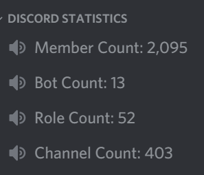

# Discord Guild Statistics Bot  

Displays Discord server statistics for members, bots, roles, and channel count. Supports multiple Discord servers.  

## Prerequisites
1.) Download .NET Core 2.1 installer: `wget https://dotnetwebsite.azurewebsites.net/download/dotnet-core/scripts/v1/dotnet-install.sh`  
2.) Set executable permissions: `chmod +x dotnet-install.sh`  
3.) Start .NET Core 2.1 installer: `./dotnet-install.sh --version 2.1.803`  

## Installation
1.) Clone repository: `git clone https://github.com/versx/GuildStats`  
2.) Copy example config `cp config.example.json config.json`  
3.) Fill out config options.  
4.) Build executable in root project folder (same folder `src` is in): `dotnet build`  
5.) Run executable via `bin/debug/netcoreapp2.1` folder: `dotnet GuildStats.dll`  

## Updating  
1.) Pull latest changes in root folder  
2.) Build project `dotnet build`  
3.) Run `dotnet bin/debug/netcoreapp2.1/GuildStats.dll`  

## Preview  
  